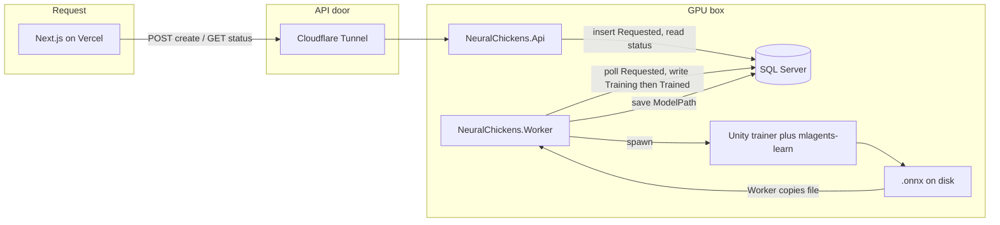
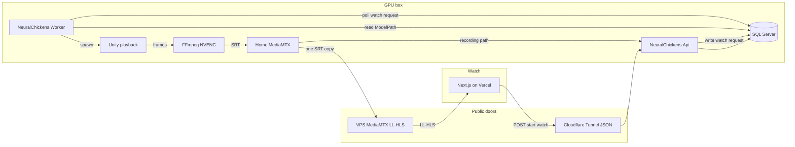

# Simulation Processing Pipeline

The GPU box trains ML-Agents brains from `Requested` simulations, then later runs those brains
live so the Vercel site can watch and the run can be saved.

Two jobs, same Worker, same machine:

1. **Train** — pick up `Requested`, run `mlagents-learn`, save `.onnx`, mark `Trained`.
2. **Watch** — on demand, run a Unity playback build with that brain and stream video.

## Pieces

| Piece | Role |
|-------|------|
| **Next.js (Vercel)** | UI. Creates simulations, polls status, plays LL-HLS. |
| **Cloudflare Tunnel** | Public HTTPS to `NeuralChickens.Api` (REST/JSON). |
| **NeuralChickens.Api** | Writes/reads SQL. Does not start Unity. |
| **SQL Server** | Job mailbox and results. |
| **NeuralChickens.Worker** | Separate .NET process. Polls SQL, starts Unity, copies brains, starts playback. |
| **Unity training build** | No-graphics. Driven by `mlagents-learn`. Writes `.onnx` under `results/<run-id>/`. |
| **Unity playback build** | Renders. Loads the trained brain and runs contestants. |
| **FFmpeg (NVENC)** | Encodes Unity frames to H.264 and pushes SRT into MediaMTX. |
| **Home MediaMTX** | Ingests one encode, records to disk, forwards one copy to the VPS. |
| **VPS MediaMTX** | Public LL-HLS for browsers. Home upload stays one stream. |
| **hls.js** | Plays LL-HLS in Next.js (~2–5 s delay). |

**LL-HLS** — live video as short HTTPS segments. **SRT** — how FFmpeg/MediaMTX send video to each other. **NVENC** — NVIDIA hardware encoder. **WHEP** — optional later (WebRTC, sub-second delay).

**`.onnx`** is the trained brain. The Editor can assign it on `BehaviorParameters` (Inference). A standalone playback build that loads a *new* file from disk needs a conversion step (`.sentis`) or onnxruntime-unity — that is Phase 2.

## Training



1. Site creates a simulation. API inserts `Requested`.
2. Worker polls, sets `Training`, writes `run-config.json`, starts `mlagents-learn` against the training build.
3. Training exits (steps cap or Worker wall-clock kill). Worker copies `.onnx`, sets `ModelPath`, marks `Trained` or `Failed`.

## Watch



1. Site asks to watch a `Trained` simulation. API records the request.
2. Worker starts the playback build with `ModelPath`.
3. Frames → FFmpeg → home MediaMTX (records) → VPS MediaMTX.
4. Browser plays the VPS LL-HLS URL. API stores the recording path.

## Decisions

- **Worker** — `NeuralChickens.Worker`, own process, references Domain, uses `NeuralChickensDbContext` directly.
- **Video** — FFmpeg + MediaMTX. One NVENC encode; MediaMTX fans out and records.
- **Builds** — training: no-graphics. Playback: rendering.
- **Phase 1 scope** — train and save `ModelPath`. Playback, stream, tunnel, VPS come later.

## Phase 0 — Train by hand

Do this before any Worker code.

1. Commit `Packages/manifest.json` ([simulator/NeuralChickensSimulator/](../simulator/NeuralChickensSimulator/)).
2. Pin matching Python `mlagents` and `com.unity.ml-agents` from the
   [ML-Agents version table](https://github.com/Unity-Technologies/ml-agents).
   [requirements.txt](../simulator/NeuralChickensSimulator/requirements.txt) has `mlagents==1.1.0`
   (Release 23 ↔ package 4.0.0). Confirm 4.1.0’s Python pair before upgrading. Use Python 3.10 in a venv.
3. Add `simulator/config/find.yaml` (PPO). Train in the Editor, then against a no-graphics build.

## Phase 1 — Worker trains

First milestone.

**Status**

```csharp
public enum SimulationStatus
{
    Requested = 0,
    Training = 1,
    Trained = 2,
    Failed = 3,
    Cancelled = 4
}
```

**Schema** — on [Simulation.cs](../backend/NeuralChickens.Api.Domain/Entities/Simulation.cs): `RunId`,
`ModelPath`, `FinalReward`, `StepsTrained`, `FailureReason`. Leave `VideoPath`. Add
`SimulationBroadcast` in Phase 2.

**Claim** — poll `Requested`, set `Training` + `StartedAt`. One Worker. Stuck `Training` rows older
than N minutes → `Failed` or back to `Requested`.

**Config** — Worker writes `run-config.json` (speed, contestants, seed). Pass with
`mlagents-learn --env-args --sim-config <path>`. Unity reads
`Environment.GetCommandLineArgs()` in `Awake()`.
([MoveToGoalAgent.cs](../simulator/NeuralChickensSimulator/Assets/Scripts/MoveToGoalAgent.cs) is hardcoded today.)

**Loop** — poll → `Training` → spawn `mlagents-learn` → log stdout → wall-clock
`CancellationTokenSource` kills the process tree → copy `.onnx` → `Trained` / `Failed`.
`mlagents-learn` caps on `max_steps`; time cap is the Worker’s job.

**API** — real get/list/cancel in
[SimulationService.cs](../backend/NeuralChickens.Api.Application/Services/SimulationService.cs).
`GetSimulationDto.CreatedAt` should map to `RequestedAt`.

**Learn** — `BackgroundService`, `Process` (stdout, cancel, kill tree), Unity `-batchmode -executeMethod` builds, trainer YAML.

## Phase 2 — Playback

Rendering Unity build. Load the brain (Editor import first; then batchmode `.onnx` → `.sentis` or
[onnxruntime-unity](https://github.com/asus4/onnxruntime-unity)). Run contestants. Add
`SimulationBroadcast` (`SimulationId`, `StreamKey`, `StartedAt`, `EndedAt`, `RecordingPath`,
`WinnerChickenId`).

## Phase 3 — Stream locally

On the GPU box / LAN.

1. FFmpeg `testsrc` → MediaMTX → `hls.js`.
2. Unity `RenderTexture` + `AsyncGPUReadback` → FFmpeg stdin (2–3 in-flight readbacks; drop frames under backpressure).
3. MediaMTX record + hooks to the API (`runOnAvailable`, `runOnRecordSegmentComplete`).
4. Next.js player: dynamic `import('hls.js')` inside `useEffect`. Read Next 16 docs under
   `web/node_modules/next/dist/docs/` first.

FFmpeg: `-preset p4 -tune ull -bf 0` and `vflip`. MediaMTX: `recordDeleteAfter: 0s`.

## Phase 4 — Public watch

Cloudflare Tunnel for the API. VPS MediaMTX (or router port-forward; CGNAT can block that) for LL-HLS.
Short-lived JWT / stream keys when streams should be gated.

## Phase 5 — Odds

Per-contestant `environment_parameters` and/or asymmetric `max_steps`.

## Checklist

### Phase 0
- [ ] Commit `Packages/manifest.json`; pin matching Python + C# ML-Agents; Python 3.10 venv
- [ ] `simulator/config/find.yaml`; train in Editor, then no-graphics build

### Phase 1
- [ ] Status: `Requested` / `Training` / `Trained` / `Failed` / `Cancelled`
- [ ] `ModelPath` + run metadata / failure reason
- [ ] `NeuralChickens.Worker`: poll → train → copy `.onnx` → update status
- [ ] `run-config.json` via `--env-args`
- [ ] Training build script
- [ ] Real get/list/cancel; fix `CreatedAt`

### Phase 2
- [ ] Rendering playback build; load brain
- [ ] `SimulationBroadcast`

### Phase 3
- [ ] testsrc → MediaMTX → `hls.js`
- [ ] Unity capture → FFmpeg → MediaMTX
- [ ] Recording + Next.js player

### Phase 4
- [ ] Tunnel (API); VPS or port-forward (video); auth if needed

### Phase 5
- [ ] Per-contestant params / budgets
