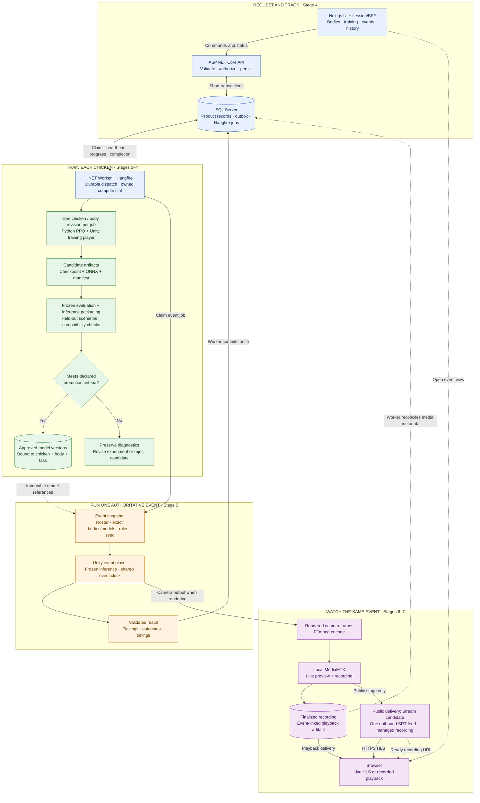

# Simulation pipeline

## Target flow

```mermaid
flowchart TB
    subgraph REQUEST["REQUEST AND TRACK · Stage 4"]
        UI["Next.js UI + session/BFF<br/>Bodies · training · events · history"]
        API["ASP.NET Core API<br/>Validate · authorize · persist"]
        DB[("SQL Server<br/>Product records · outbox · Hangfire jobs")]
        UI -->|"Commands and status"| API
        API <-->|"Short transactions"| DB
    end

    subgraph LEARN["TRAIN EACH CHICKEN · Stages 1–4"]
        WORKER[".NET Worker + Hangfire<br/>Durable dispatch · owned compute slot"]
        TRAIN["One chicken / body revision per job<br/>Python PPO + Unity training player"]
        CANDIDATE["Candidate artifacts<br/>Checkpoint + ONNX + manifest"]
        VALIDATE["Frozen evaluation + inference packaging<br/>Held-out scenarios · compatibility checks"]
        PASS{"Meets declared<br/>promotion criteria?"}
        READY[("Approved model versions<br/>Bound to chicken + body + task")]
        REVIEW["Preserve diagnostics<br/>Revise experiment or reject candidate"]
        WORKER --> TRAIN --> CANDIDATE --> VALIDATE --> PASS
        PASS -->|"Yes"| READY
        PASS -->|"No"| REVIEW
    end

    subgraph EVENT["RUN ONE AUTHORITATIVE EVENT · Stage 5"]
        SNAPSHOT["Event snapshot<br/>Roster · exact bodies/models · rules · seed"]
        RUN["Unity event player<br/>Frozen inference · shared event clock"]
        RESULT["Validated result<br/>Placings · outcomes · timings"]
        SNAPSHOT --> RUN --> RESULT
    end

    subgraph VIDEO["WATCH THE SAME EVENT · Stages 6–7"]
        CAPTURE["Rendered camera frames<br/>FFmpeg encode"]
        LOCAL["Local MediaMTX<br/>Live preview + recording"]
        RECORD[("Finalized recording<br/>Event-linked playback artifact")]
        PUBLIC["Public delivery: Stream candidate<br/>One outbound SRT feed · managed recording"]
        VIEWER["Browser<br/>Live HLS or recorded playback"]
        CAPTURE --> LOCAL
        LOCAL --> RECORD -->|"Playback delivery"| VIEWER
        LOCAL -->|"Public stage only"| PUBLIC -->|"HTTPS HLS"| VIEWER
        PUBLIC -.->|"Ready recording URL"| VIEWER
    end

    DB <-->|"Claim · heartbeat · progress · completion"| WORKER
    READY -.->|"Immutable model references"| SNAPSHOT
    WORKER -->|"Claim event job"| SNAPSHOT
    RUN -->|"Camera output when rendering"| CAPTURE
    RESULT -->|"Worker commits once"| DB
    RECORD -.->|"Worker reconciles media metadata"| DB
    UI -.->|"Open event view"| VIEWER

    classDef control fill:#e8f0fe,stroke:#2857a4,color:#142850
    classDef learning fill:#e8f5e9,stroke:#2e7d32,color:#173f1b
    classDef event fill:#fff3e0,stroke:#b56800,color:#663b00
    classDef media fill:#f3e5f5,stroke:#7b1fa2,color:#45115c
    class UI,API,DB,WORKER control
    class TRAIN,CANDIDATE,VALIDATE,PASS,READY,REVIEW learning
    class SNAPSHOT,RUN,RESULT event
    class CAPTURE,LOCAL,RECORD,PUBLIC,VIEWER media
```

