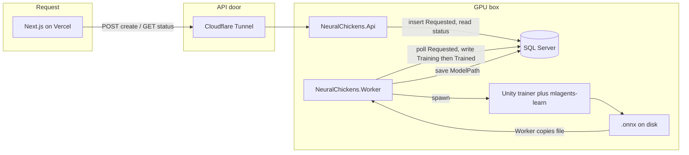
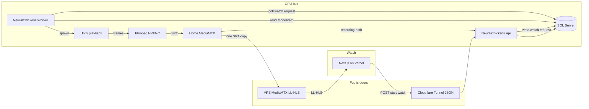

# Simulation Processing Pipeline

Design doc for the system that takes `Simulation` rows in `Requested` state, trains an
ML-Agents brain for them in Unity, and later plays them back as a live video stream.

## Target architecture

Two separate jobs. Training never streams. Live watch never trains. Both run on the GPU box;
the Worker is its own process and is the only thing that starts Unity.





**Two different “spawns” (do not merge them):**

1. **Training spawn** — Worker sees a row in `Requested`, claims it, starts `mlagents-learn` + the headless Unity training build. When that process exits, the Worker reads the `.onnx` from disk and marks the simulation `Trained`. No video, no viewers.
2. **Playback spawn** — Later, when a user or the API asks to *watch* a trained simulation, the Worker (or a playback job it owns) starts the Unity *playback* build with that brain, pipes frames through FFmpeg → MediaMTX, and records a `SimulationBroadcast`. Training finishing does **not** automatically go live; live play is on demand.

Same Worker process can own both loops: poll for training jobs, and poll (or receive) for “start broadcast for simulation X” requests.

## Glossary — how the live video path works

Think of two separate “doors” from the public internet into your home server:

| Door | Carries | How it gets to your house |
|------|---------|---------------------------|
| API door | JSON (create sim, get status, “please start stream”) | Cloudflare Tunnel |
| Video door | Actual video bytes for the browser player | VPS relay (or port-forward) |

Your Next.js site on Vercel cannot talk to `localhost` on your PC. Something has to expose your home box. We use **two different something’s** because Cloudflare is great for APIs and a bad fit for video.

### MediaMTX

A single program (one `.exe` on Windows) that acts as a **mini Twitch for your house**.

- One process pushes video *into* it (FFmpeg encoding Unity’s frames).
- Many browsers can pull that same stream *out* of it.
- While live, it can also **record** the stream to a file on disk (your VOD / `SimulationBroadcast` recording).

You do not write a streaming server yourself. MediaMTX is that server.

### FFmpeg (+ NVENC)

Unity produces raw frames. FFmpeg compresses them into H.264 video. **NVENC** is the encoder chip on your NVIDIA GPU, so compression is mostly free relative to training. FFmpeg then pushes that compressed stream into MediaMTX (often over **SRT**, a reliable “send video from A to B” protocol).

### HLS and LL-HLS

**HLS** (HTTP Live Streaming) is how most websites play live video: the server chops the stream into tiny file segments; the browser downloads them in order (like a slideshow of 1–2 second video clips). Normal HLS is often **10–30 seconds** behind live.

**LL-HLS** (Low-Latency HLS) is the same idea with smaller pieces, so the delay is usually **~2–5 seconds**. In the browser you typically use the **`hls.js`** library to play it (Safari can do HLS natively).

This is the “ship first” path: simple, works through normal HTTPS, good enough for watching a sim.

### WHEP (and WebRTC)

**WebRTC** is the tech behind Zoom/Discord: peer video with much lower delay (**often under a second**).

**WHEP** is a small standard for “browser, please *watch* this WebRTC stream” (HTTP request to get the stream). MediaMTX can serve WHEP as well as LL-HLS from the **same** incoming encode.

Optional later if you want snappier video or interactive control. Harder to expose from home (needs UDP / careful networking).

### Ingress

**Ingress** just means “how traffic enters your system from the public internet.” In the diagram, the `edge` box is that entry layer — not a product named Ingress.

### Cloudflare Tunnel (JSON API only)

Your API runs at home. Vercel users need `https://something` that reaches it.

**Cloudflare Tunnel** (`cloudflared`) creates an **outbound** connection from your PC to Cloudflare. Cloudflare then gives you a public URL. No need to open router ports for the API. Requests like `GET /api/simulations/5` go:

`Browser → Cloudflare → Tunnel → your ASP.NET API`

“**JSON API only**” means: use this door for REST/JSON. Do **not** push the live video through it. Cloudflare’s free/cheap CDN terms discourage serving video that way, and WebRTC/UDP does not work well through the tunnel anyway.

### VPS relay (video)

A **VPS** is a cheap always-on cloud computer with a real public IP (~$5/mo).

**Relay** means: your home MediaMTX sends **one** copy of the stream up to MediaMTX on the VPS; viewers worldwide pull from the VPS. Your home upload stays ~one stream no matter how many people watch.

Alternative: port-forward video ports on your home router (free, but depends on your ISP; **CGNAT** can make it impossible). The plan prefers the VPS when you want a reliable public watch URL.

### End-to-end picture (one live watch)

Matches the second diagram: JSON goes through the tunnel to the API; the Worker polls the DB;
video never uses the tunnel.

```
Browser  --JSON start watch-->  Cloudflare Tunnel  -->  Api  -->  SQL
Worker polls SQL, starts Unity playback
Unity  -->  FFmpeg  -->  home MediaMTX  --one SRT copy-->  VPS MediaMTX
Browser  --LL-HLS-->  VPS MediaMTX
home MediaMTX recording path  -->  Api  -->  SQL
```

## Key decisions

- **Worker orchestration in .NET.** A new `NeuralChickens.Worker` project referencing
  `NeuralChickens.Api.Domain` so it shares `NeuralChickensDbContext`. Direct DB access rather than
  HTTP — simplest for a solo project; the coupling is acceptable because both are our code and
  deploy together.
- **Streaming via FFmpeg + MediaMTX, not Unity Render Streaming.** Render Streaming's last
  functional release was Dec 2024, it officially supports only Unity 2020–2023, its
  `com.unity.webrtc` dependency was deprecated in Aug 2026, and it does one encode *per viewer*
  (~5 max). FFmpeg + MediaMTX encodes once and fans out to unlimited viewers while recording to
  disk in the same pass. NVENC is a dedicated ASIC separate from the CUDA cores training uses, so
  streaming costs almost no training throughput.
- **Separate Unity builds for training and playback.** Training is headless; playback renders and
  streams. Different requirements, different build targets.

## Phase 0 — De-risk the foundations

Do this before writing any worker code; each item is a known trap.

- **Commit `Packages/manifest.json`.** [simulator/NeuralChickensSimulator/](../simulator/NeuralChickensSimulator/)
  has no `Packages/` folder tracked at all, so the ML-Agents and URP versions aren't pinned
  anywhere. This is the biggest reproducibility hole right now.
- **Pin versions deliberately.** Verify the Python/C# pairing on the
  [ML-Agents README version table](https://github.com/Unity-Technologies/ml-agents) and pin both
  sides. See [Open question](#open-question).
- **Python version.** `mlagents` is strict about Python (3.10.x for 1.1.0). Set up a dedicated venv
  on the server.
- **Write a trainer YAML.** None exists in the repo. Create `simulator/config/find.yaml` with a PPO
  block and get `mlagents-learn` training against the Editor first, then against a build.
- **Clarify the runtime-brain problem (you *can* reuse trained agents).** Training produces an
  `.onnx` file. That *is* the saved brain. In the Unity Editor, you drop it onto
  `BehaviorParameters` and the agent runs in Inference mode — that is the normal ML-Agents workflow
  and works today. The spike is only about the *automated* path: a Worker that keeps producing new
  brains, and a *standalone playback build* that must load whichever `.onnx` the Worker just wrote,
  without a human opening the Editor. Unity's Inference Engine will not load a raw `.onnx` from disk
  at runtime (ONNX→`.sentis` conversion is Editor-only), and `BehaviorParameters.SetModel` wants a
  `ModelAsset`. For Phase 1 (train + save the file + store the path), this does not block you. For
  Phase 2 (auto-play any trained brain), pick one of:
  1. After training, run `Unity.exe -batchmode -executeMethod ModelPacker.Serialize` to convert
     `.onnx` → `.sentis`, then load that file in the playback build.
  2. [onnxruntime-unity](https://github.com/asus4/onnxruntime-unity) to run the `.onnx` directly.
  3. For early demos only: import the `.onnx` in the Editor by hand — fine for learning, not for
     the production Worker.

## Phase 1 — Training pipeline (first milestone)

### Schema changes

`SimulationStatus` currently stops at `Completed` and has no failure path. Extend it:

```csharp
public enum SimulationStatus
{
    Requested = 0, Claimed = 1, Training = 2, Trained = 3,
    Failed = 4, Cancelled = 5
}
```

Add training artifact fields to
[Simulation.cs](../backend/NeuralChickens.Api.Domain/Entities/Simulation.cs): `RunId`, `ModelPath`,
`FinalReward`, `StepsTrained`, `ClaimedAt`, `LeaseExpiresAt`, `FailureReason`. Drop `VideoPath` — it
belongs on a broadcast, not a training job.

Add a **`SimulationBroadcast`** entity. A trained simulation can be played live many times, so
playback needs its own lifecycle: `Id`, `SimulationId`, `StreamKey`, `StartedAt`, `EndedAt`,
`RecordingPath`, `WinnerChickenId`. This is what "the live demonstration is saved in the database"
actually means.

### Job claiming

One worker today, but write the claim correctly from the start so a crashed worker doesn't strand
jobs:

```sql
UPDATE TOP (1) s WITH (ROWLOCK, READPAST)
SET Status = 1, WorkerId = @workerId, LeaseExpiresAt = DATEADD(minute, 5, SYSUTCDATETIME())
OUTPUT INSERTED.Id
FROM Simulations s
WHERE Status = 0 OR (Status IN (1,2) AND LeaseExpiresAt < SYSUTCDATETIME())
```

Heartbeat the lease from the worker while training runs.

### Parameterizing Unity per run

[MoveToGoalAgent.cs](../simulator/NeuralChickensSimulator/Assets/Scripts/MoveToGoalAgent.cs)
hardcodes everything (`moveSpeed = 2f`, reset to `Vector3.zero`). Two mechanisms, use both:

- **Structural config** (contestants, arena, seed): worker writes `run-config.json`, passes it
  through `mlagents-learn --env-args --sim-config <path>`, Unity reads it in `Awake()` via
  `Environment.GetCommandLineArgs()`.
- **Scalar tunables** (speed, reward weights): the `environment_parameters` block in the trainer
  YAML, read via `Academy.Instance.EnvironmentParameters.GetWithDefault("speed", 3f)`. This is also
  the mechanism reused for odds shaping in Phase 5, so wiring it now pays off twice.

### Worker loop

`Poll → claim → generate YAML + run-config → spawn mlagents-learn → stream stdout to logs → enforce
wall-clock cap → parse results/<run-id>/ → copy .onnx → update status`.

The wall-clock cap ("trained past a certain time limit") is a `CancellationTokenSource` timeout that
kills the process tree — `mlagents-learn` caps on `max_steps`, not time, so time-capping is our job.

### API surface

Replace the stubs in
[SimulationService.cs](../backend/NeuralChickens.Api.Application/Services/SimulationService.cs) —
`GetSimulationAsync` currently returns hardcoded data. Add list/filter, cancel, and a real status
read. Note `GetSimulationDto` exposes a `CreatedAt` that doesn't exist on the entity.

## Phase 2 — Playback build (offline before live)

Get a headless playback run producing a correct result and a local MP4 *before* introducing
streaming. A second Unity build target that loads the trained brain, runs N contestants, records the
winner, and writes a `SimulationBroadcast` row.

## Phase 3 — Streaming

Build bottom-up, isolating the streaming stack from the capture stack:

1. **FFmpeg `testsrc` → MediaMTX → hls.js in the browser.** No Unity involved. Prove the pipe first.
2. **Unity `AsyncGPUReadback` → FFmpeg stdin.** Render to a `RenderTexture`, keep 2–3 readbacks in
   flight so the render thread never stalls, drop frames rather than block.
3. **MediaMTX recording + webhooks** back to the API.
4. **Player component** in Next.js.

Five traps worth pre-empting:

- `-bf 0` on NVENC, or WebRTC silently shows black — browsers reject H.264 B-frames.
- `recordDeleteAfter: 0s`, or recordings vanish after 24h.
- The hook is `runOnAvailable`, not `runOnReady` — renamed in MediaMTX v1.19.3, so every tutorial
  is stale.
- `-preset llhq` no longer exists; it's `-preset p4 -tune ull`.
- Unity's readback is bottom-up, so FFmpeg needs `vflip`.

`hls.js` must be dynamically imported inside `useEffect` — it touches `window` at module scope and
will break SSR. Per [web/AGENTS.md](../web/AGENTS.md), check `node_modules/next/dist/docs/` before
writing Next.js code; this is Next 16 with breaking changes.

## Phase 4 — Public exposure

Cloudflare Tunnel for the API, VPS relay or port-forward for video, short-lived JWTs minted by the
API for stream authorization (MediaMTX supports `authMethod: jwt` with a JWKS endpoint).

## Phase 5 — Odds shaping

Per-contestant `environment_parameters` and asymmetric training budgets. Phase 1's parameter
plumbing is the prerequisite.

## What to learn

Roughly in the order it comes up:

- .NET `BackgroundService`, and `System.Diagnostics.Process` with redirected stdout, cancellation,
  and process-tree kill
- SQL job-queue patterns: claim/lease/heartbeat, `READPAST`
- ML-Agents trainer YAML and PPO hyperparameters, `mlagents-learn` CLI, `EnvironmentParameters`,
  side channels
- Unity `BuildPipeline` Editor scripts driven by `-batchmode -executeMethod`
- Unity Inference Engine model loading, `AsyncGPUReadback`, `RenderTexture`
- FFmpeg rawvideo input, NVENC low-latency flags, SRT
- MediaMTX config, hooks, control API
- HLS/LL-HLS/WebRTC fundamentals and `hls.js`
- Practical networking: NAT, CGNAT, port forwarding, TLS, reverse proxying

## Open question

Whether to stay on `mlagents==1.1.0` / package 4.0.0 or move to 4.1.0. Resolve this as the first
Phase 0 task by reading the version table on the
[ML-Agents README](https://github.com/Unity-Technologies/ml-agents) — it maps each release to its
exact Python `mlagents` version and C# package version. Release 23 (Aug 2025) pairs `mlagents`
1.1.0 with package 4.0.0, which is what
[requirements.txt](../simulator/NeuralChickensSimulator/requirements.txt) currently targets; 4.1.0
shipped July 2026 and needs its Python counterpart confirmed rather than assumed. Nail the pairing
down before building anything, since a mismatch surfaces as confusing gRPC handshake failures at
training time rather than a clean error.

## Checklist

### Phase 0 — Foundations
- [ ] Commit `Packages/manifest.json`; pin `com.unity.ml-agents` and the matching Python `mlagents`
- [ ] Set up a Python 3.10 venv on the server
- [ ] Write `simulator/config/find.yaml` and train against the Editor, then a headless build
- [ ] SPIKE (Phase 2 only): automate loading a Worker-produced brain in a standalone build
      (batchmode `.sentis` conversion, or onnxruntime-unity). Editor drag-and-drop still works.

### Phase 1 — Training pipeline
- [ ] Extend `SimulationStatus`, add training artifact fields, add `SimulationBroadcast`, drop `VideoPath`, migrate
- [ ] Create `NeuralChickens.Worker` BackgroundService with claim/lease/heartbeat polling
- [ ] Parameterize the Unity agent via `run-config.json` + `EnvironmentParameters`
- [ ] Editor `BuildPipeline` script for the headless training build
- [ ] Worker spawns `mlagents-learn`, streams logs, enforces wall-clock cap, parses results, copies `.onnx`
- [ ] Replace `SimulationService` stubs; add list/filter/cancel; fix the `CreatedAt` mismatch

### Phase 2 — Playback
- [ ] Unity playback build: load trained brain, run contestants headless, record winner

### Phase 3 — Streaming
- [ ] Prove FFmpeg `testsrc` → MediaMTX → hls.js with no Unity involved
- [ ] Unity `AsyncGPUReadback` → FFmpeg stdin → SRT
- [ ] MediaMTX recording + webhooks into the API
- [ ] Next.js player component and simulation status UI

### Phase 4 — Exposure
- [ ] Cloudflare Tunnel for the API, VPS relay or port-forward for video, JWT stream auth

### Phase 5 — Odds shaping
- [ ] Per-contestant `environment_parameters` and asymmetric training budgets
