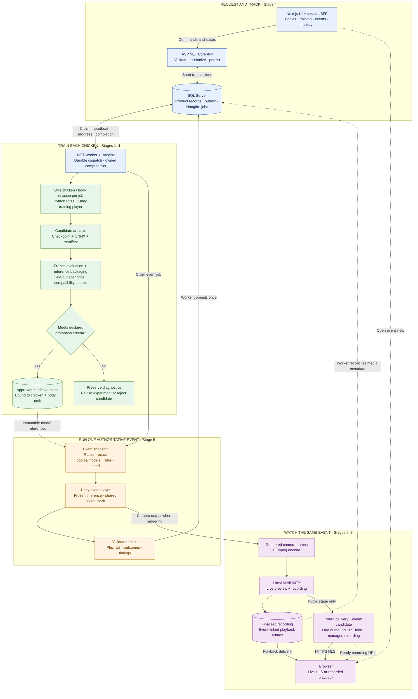
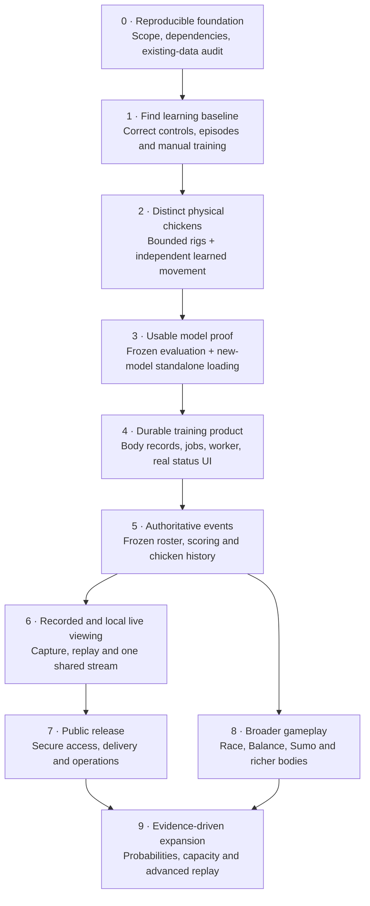

# Simulation pipeline

**Goal:** chickens with different 2D sizes/appendages, each trained independently. First release: create a roster, train each chicken, run a scored Find event, and watch its recording. Live viewing and more modes follow.

[Tasks and progress](../TASKS.md) · [Tools, implementation locations and sources](technology-map.md)

Reviewed 2026-09-11 against `b389044`. Existing work below is verified in source only; no builds, training, migrations or deployments were run.

## Starting point

| Present | Remaining |
|---|---|
| .NET API/Application/Domain/Common projects; EF entities, relationships and two migrations. | Worker, model/body history and reliable execution. |
| [Find creation](../backend/NeuralChickens.Api.Application/Services/SimulationService.cs) saves Simulation + configuration. | Validation, real participants/readback/list/cancel. GET is hardcoded; start/video are no-ops. |
| [Training status enum](../backend/NeuralChickens.Api.Common/Enums/SimulationStatus.cs). | Align stored data, DBML, DTOs and web types. |
| [Unity Find agent](../simulator/NeuralChickensSimulator/Assets/Scripts/MoveToGoalAgent.cs), Rigidbody2D prefab and 24 arenas. | Correct physics/configuration, articulated bodies and validated training. Arenas currently share one policy. |
| Committed Unity packages; Next.js UI/request scaffolding; video-storage interface. | Reproducible Python setup, real creation/history/player flows and media implementation. |

**Fix early:**

- Status commit `9a50da6` reused stored integers: old `3=InProgress / 4=Completed` became `Failed / Cancelled`. Audit database provenance and explicitly map existing rows; preserve ambiguous data.
- Unity URP manifest `17.6.0` disagrees with lockfile `17.5.0`. Python `requirements.txt` contains shell commands. Reconcile and lock a tested toolchain.
- Keep `RequestedAt`; remove or consistently map redundant `CreatedAt`. Pending timestamps remain nullable.
- The current Find agent mixes dynamic Rigidbody2D with Transform movement, hardcodes speed, logs every action and scales manual actions differently.

## Target flow

SQL stores product/job state and artifact references. Files live outside SQL/source control. The API accepts work; the Worker supervises it.

**Watching never starts a competition.** Join an existing event or play its recording. A rematch gets a new event ID. Recording delivery uses authorized URLs, not local paths.

For public video, test Cloudflare Stream within a budget; MediaMTX+Caddy is the self-hosted alternative. Local MediaMTX retains preview/recording. Next.js forwards short authenticated JSON requests and never relays video.

## Rules that shape the implementation

### Bodies and independent learning

- Begin with bounded rig templates, sizes, appendages, masses and motor strengths. Proposed physical mode: side-view 2D with gravity; confirm in Stage 0.
- Each chicken owns a frozen body revision, independent initialization, run ID, checkpoints and model history. Parallel arenas may copy **only that chicken/body** within its training run.
- Version sensor/action order and dimensions per rig. Different rigs can use different model shapes. Physical changes require a new body revision and compatible evaluated model; cosmetics do not.
- Actions drive Rigidbody2D joints/motors. Normalize observations, bound controls, fix physics/decision timing and reset all body/episode state. Validate collisions, anchors, mass ratios and spawn clearance.
- Start with PPO/vector observations and simple rewards. Add shaping/curriculum only after measuring a learning problem. A chicken may continue its own compatible checkpoint; cross-chicken weight transfer is not the default.
- Initial competitions use equivalent isolated lanes, one clock and explicit goal/tie/timeout rules. Shared-contact competition needs separate training/evaluation.

### Training, model approval and events

| Step | Required output |
|---|---|
| Train | Candidate ONNX, resumable checkpoints, effective config and metrics. |
| Evaluate | Frozen-policy outcomes on held-out episodes; no weight updates. |
| Package | Model that loads correctly in the intended standalone build. |
| Approve | Compatibility **and** evaluation pass. Trainer exit alone is insufficient. |
| Compete | Immutable roster/body/model/rules snapshot and one authoritative result. |
| Record/watch | Media linked to that event, with its own readiness/failure state. |

Keep raw episode outcomes and report success, time, falls/stalls, collisions and control effort separately from training reward or wins.

**Initial evaluation target:** simple Find succeeds in at least 90/100 held-out episodes, with zero invalid-physics episodes and random/scripted comparisons. Set articulated-body thresholds after manual-control validation. Check the recipe across at least three training seeds; keep a separate final benchmark set. These are proposed criteria, not measured results.

**Model-delivery gate:** first import ONNX as a Unity ModelAsset. Then prove isolated Editor → AssetBundle packaging lets one unchanged player run two independently trained models simultaneously, including one created after the player build. Validate both rigs/schemas and action parity.

Checkpoints support training continuation; ONNX is an inference export. A serialized `.sentis` loader returns a `Model`, while ML-Agents `Agent.SetModel` expects `ModelAsset`. Another inference runtime requires an adapter. Packaging remains an unproven integration, including Editor availability/licensing and platform compatibility.

### Durable execution

Use **Hangfire Core + SQL Server inside a separate .NET Worker**. Hangfire owns scheduling; application records own chicken/model/event meaning.

1. Save the request, domain jobs and outbox dispatch intent in one EF transaction.
2. Dispatch ID-only jobs. Duplicate delivery is possible; atomically guard attempts and reject stale completion writes.
3. Start with one compute queue and `WorkerCount=1`, plus duplicate-host prevention. Benchmark before allowing training/rendering together.
4. Supervise the full trainer/Unity/evaluator/packager lifetime: private directories, server-owned arguments, asynchronous stdout/stderr, progress, deadlines and process identity.
5. Cancellation requests are durable. Allow a bounded checkpoint/export grace period, then verify child-tree cleanup. Resolve completion/cancel races once.
6. Start with zero automatic exception retries; crash redelivery still occurs. Reconcile processes/output before bounded transient retries. An interrupted observed event becomes failed; a rematch gets a new ID.
7. Validate hashes/manifests, atomically publish immutable artifacts, then commit references. Recover crashes between file publication and SQL commit.

Do not hold SQL transactions during execution or accept stale ONNX files as success after a kill. Retry only failed chickens; preserve successful models and completed results. Keep process failure distinct from model rejection.

### Contracts and storage

| Record | Owns |
|---|---|
| Chicken / BodyRevision | Identity/ownership and immutable physical configuration. |
| Simulation / SimulationChicken | Request/configuration and default roster. |
| TrainingJob / JobAttempt / outbox | Budgets, seeds, lifecycle, dispatch, ownership, cancellation and diagnostics. |
| ModelVersion / EvaluationRun | Chicken/body/task compatibility, artifact hashes, benchmark evidence and approval. |
| SimulationRun / RunParticipant | Event-owned roster, exact body/model versions, lane, rules and seed. |
| ParticipantResult | Placings, timings and terminal reasons; mode-specific detail where needed. |
| Broadcast / recording | Event association, stream/provider IDs, segments, readiness, storage and retention. |

Default roster changes never alter historical events. Migrate existing simulation-level result tables when introducing repeated events. Validate winners belong to the event; derive win totals or update them idempotently.

| Lifecycle | Meaning |
|---|---|
| Attempt | Queued → Running → Succeeded / Failed / Cancelled; retry creates an attempt. |
| Model | Candidate → Approved / Rejected. |
| Simulation readiness | Existing Requested / Training / Trained / Failed / Cancelled; Trained requires all needed models approved. |
| Event | Queued → Running → Completed / Failed / Cancelled. |
| Media | Pending → Live/Recording → Finalizing → Ready / Failed. |

Version JSON config/results and trainer YAML recipes. Apply configuration before agents initialize; share body/control/rules code across training, evaluation and events. Artifact manifests retain chicken/body/run IDs, seeds, effective config, policy/rules versions, source/build/dependency versions, evaluation and file hashes.

Expose validated create/get/list/history/cancel/retry/event/results/media APIs. Use generated OpenAPI types, UTC/null timestamps, Problem Details, ownership checks and idempotent costly commands. Separate roster size, arena count and compute capacity; validate finite numeric bounds. Keep paths, executables and credentials internal.

### Media and public operation

- Prove synthetic ingest, then a complete recorded Unity event, then local live viewing. Rendering needs a graphics-enabled player; no-graphics training/evaluation uses compatible inference.
- Benchmark bounded RenderTexture/readback → FFmpeg capture, timestamps, orientation and frame drops. Keep media failure separate from event results.
- Reconcile recording hooks, segments and readiness; local files do not automatically become VOD HLS. Keep a faithful recording—seeds alone do not guarantee identical physics replay.
- Public access requires identity/ownership, quotas, rate limits, TLS and private SQL/management endpoints. Auth0/OIDC + Next session/BFF + API JWT validation is the candidate.
- Budget before provisioning a public-video trial; test latency/live/replay before launch. Persist provider input/recording IDs and reconcile readiness.
- Test Windows lock/disconnect/logout/reboot; queue rendering when the required graphics session is absent.
- Monitor queue/attempt/storage/media health. Back up SQL and referenced artifacts together, then prove restoration.

## Development order

| Stage | Completion criterion |
|---|---|
| **0 — Foundation** | Reproducible toolchain, bounded first bodies/task, budgets and reviewed status-data mapping. |
| **1 — Find baseline** | Correct controls/resets; manual Editor and standalone training passes held-out criteria. |
| **2 — Physical individuality** | Two different bodies learn useful movement in independent runs. |
| **3 — Model delivery** | One unchanged player simultaneously runs both models/rigs, including a post-build model; rejects mismatches. |
| **4 — Durable training** | Real UI/API trains a roster through Hangfire; cancellation/restarts preserve truthful status and model ownership. |
| **5 — Events/history** | One frozen roster produces one durable result; history and repeated events stay distinct. |
| **6 — Local media** | Seekable recording matches results; multiple viewers share one live event. |
| **7 — Public release** | Protected external workflow, acceptable delivery cost/latency and demonstrated recovery. |
| **8 — Gameplay** | Race/Balance/Sumo and expanded bodies each pass physics, learning, scoring and recording checks. |
| **9 — Measured growth** | Analytics/capacity additions show measured benefit and bounded cost. |

Stage 8 can follow Stage 5 alongside media/public work. Stage 4 API/UI and Worker work can parallelize after contracts settle. Synthetic media tests can precede Unity capture. Track milestones in [TASKS.md](../TASKS.md).

## Later, when justified

- **Sumo:** independent learners against frozen opponent pools; validate heterogeneous schemas and held-out opponents before self-play.
- **Probabilities:** repeated frozen events, sample counts, uncertainty and calibration. Training-step budgets are not odds.
- **Scale:** profile before more workers, external brokers, object storage/CDN or low-latency WebRTC.
- **Research:** arbitrary bodies, advanced RL, shared pretraining and state replay require specific evidence and separate validation.

Test physics/reset contracts, model ownership/compatibility, real SQL dispatch and stale writes, cancellation/crash recovery, artifact publication, scoring and media association. Use fake child processes for routine failure tests; reserve real Unity/GPU/training checks for a suitable host. CI covers normal .NET/web/Unity checks without retraining on every change.
